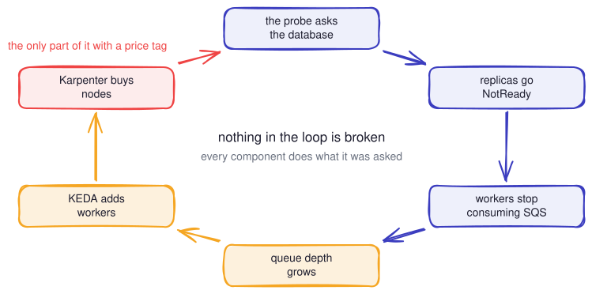

# The probe that killed itself

A Kubernetes talk about six lines of YAML, told as two incidents that really
run. Nothing here is a slide of bullet points pretending a cluster broke: the
pods die on a real EKS cluster, the autoscalers really buy machines, and the
bill is real too.

<p align="center">
  
</p>

**Incident 1.** A service takes ten seconds to start. Its liveness probe was
copied out of an article: two seconds before the first question, three misses a
second apart. Five seconds of patience against a ten second start. The pod is
killed on the fifth second, every time, and nobody wrote a bug.

**Incident 2.** A readiness probe that passes review, because it does the
honest thing and queries the database. At three replicas the database does not
notice. At twenty-four it runs out of connections, every replica goes NotReady
at once, the queue backs up, KEDA adds workers to drain it, and Karpenter buys
machines for the workers. Every component is doing exactly what it was asked.
One step in that circle is billed by the hour.

The talk ends on [the checklist](docs/CHECKLIST.md), which is the part worth
taking to work.

## What is in here

| | |
| --- | --- |
| [`docs/CHECKLIST.md`](docs/CHECKLIST.md) | the conclusions, in the form you can use on Monday |
| [`docs/RUNBOOK.md`](docs/RUNBOOK.md) | how the show is run, step by step, including what to do when it breaks |
| [`k8s/incident1/`](k8s/incident1) · [`k8s/incident2/`](k8s/incident2) | the manifests that fail, and the ones that do not, side by side |
| [`app/`](app) | a small Go service with the failure modes built in, switched by environment variable |
| [`infra/`](infra) | Terragrunt stack: VPC, EKS, Karpenter, KEDA, RDS |
| [`steps/`](steps) · [`lib/`](lib) | the driver that runs the show on stage |
| [`slides/`](slides) | the deck, which is the fallback for when the cluster is not available |

## Watching it without running it

The whole show is recorded. `slides/public/casts/full.cast` is one
[asciinema](https://asciinema.org) recording of a complete run, and
`full.cuts.json` marks where each step begins, so it can be played a step at a
time rather than as one long file.

```sh
asciinema play slides/public/casts/full.cast
```

The deck plays the same recording inline. `task deck` opens it in a browser,
`task deck:pptx` exports a PowerPoint with the recordings as video.

## Running it yourself

> [!WARNING]
> This costs real money and it is supposed to. An EKS control plane, an RDS
> instance and whatever Karpenter decides to buy during incident 2 come to
> roughly **$0.40 an hour at rest**, more while the autoscalers are working.
> `task down` when you stop, not later. `task cost:check` tells you whether
> anything is still running.

You need an AWS account you are allowed to spend money in, plus
[Task](https://taskfile.dev), Terragrunt, kubectl, k9s, tmux and Go.

```sh
task bootstrap   # VPC, cluster, image, two million rows of seed data (~25 min)
task preflight   # one screen of checks before you go on
./stage          # the tmux layout and the driver: this is the show
task down        # and this is the part people forget
```

`task smoke` runs every step unattended and asserts the failures still happen,
which is how the show is checked before it is given.

## How the show works

There are no slides during the talk. The stage is a tmux window: the driver in
one pane, `k9s` in another, and a panel counting Karpenter nodes, queue depth
and database connections in a third. The driver prints the dialogue, applies
the manifests, and waits for the cluster with a countdown so the room can see
that the wait is deliberate.

The deck exists for the day the venue network does not. It carries the same
recording cut per step, so losing one step costs that step and nothing else.
Both decks are generated from a single file, [`slides/talk.md`](slides/talk.md):
`task deck:build` makes the HTML one, `task deck:pptx` makes a PowerPoint on the
conference template, with the recordings as playable video and the diagrams
revealed a piece at a time.

## Credits

Written and given by [Alexander Dovnar](https://alex-dovnar.in). The numbers in
the manifests, the two incidents and the checklist come out of real outages.

The characters are not: Timur ships the service, Ruslan tunes the numbers,
Madina reads the documentation, and Karpenter has a credit card. Any resemblance
to your team is coincidental. Probably.
