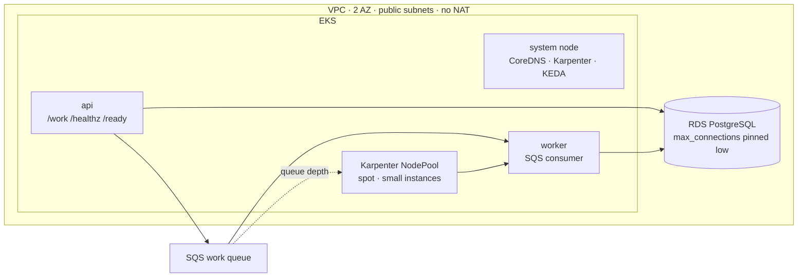
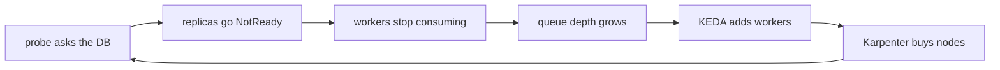

# The probe that killed itself

## A health check, two autoscalers, and an EC2 bill

Alexander Dovnar · Naviteq · AWS Community Day Central Asia 2026

<!--
This deck is not the talk. The talk is the terminal.

Use it when the cluster cannot be used: the recordings on the incident slides are
full runs of the same show, cut per segment, so a failure at step 2.2 costs you
2.2 and nothing else. Everything else here is what a terminal cannot show — the
architecture, the feedback loop, the checklist.
-->

---
layout: default
---

# Something is asking your container questions

Not a load balancer. Not a human. **kubelet**, every few seconds, forever, using
numbers out of your manifest.

<div class="grid grid-cols-3 gap-4 mt-8">

<NqCard accent="primary">

**startup**

Has it finished booting?

Holds the other two off while it runs.

</NqCard>

<NqCard accent="primary">

**liveness**

Is the process alive?

A wrong answer **restarts the container**.

</NqCard>

<NqCard accent="primary">

**readiness**

Can it serve right now?

A wrong answer **takes it out of the Service**.

</NqCard>

</div>

<div class="mt-10 text-lg">

Of everything that can take a container down — a crash, an OOM, an eviction, a
rollout — a probe is the only one that does it **while the process is working
perfectly well**.

</div>

<!--
The one piece of theory that has to come before the first failure. In the live
show this is a single card in the titles; here it is a slide because the room
has nothing else to look at.
-->

---
layout: default
---

# What is actually running



<div class="mt-6 text-sm op75">

Three deliberate constraints: **no NAT gateway** (the quiet $32/month), **spot
and small instances** so scaling is visible as node *count*, and a
**non-burstable** RDS class so the failure reproduces on the day instead of
running out of CPU credits halfway through.

</div>

<!--
Thirty seconds, no more. The only parts that matter for the story are the pinned
max_connections and the fact that KEDA reads the queue while Karpenter reads
Pending pods.
-->

---
layout: section
variant: 2
---

# Incident 1

## The probe that kills a healthy pod

---
layout: two-cols
---

# It is arithmetic, not a bug

The service warms up for **30 seconds**.

The probe Timur copied out of a blog post:

- `initialDelaySeconds: 5` — wait this long before the first question
- `periodSeconds: 5` — then ask again this often
- `timeoutSeconds: 1` — an answer slower than this is a miss
- `failureThreshold: 3` — this many misses and the pod dies

<div class="mt-6 text-lg">

<NqHighlight type="solid" color="accent">Patience = 5 + 3 × 5 = 20 seconds.</NqHighlight>

The service needs 30. Nothing here is a bug, and the pod dies every single time.

</div>

::right::

<div class="pl-6">

```yaml
livenessProbe:
  httpGet: { path: /healthz, port: 8080 }
  initialDelaySeconds: 5
  periodSeconds: 5
  timeoutSeconds: 1
  failureThreshold: 3
```

<div class="mt-4 text-sm op75">

Raising `initialDelaySeconds` is the fix everyone reaches for. It holds until the
day the start gets slower — a cold cache, a noisier neighbour, one more step at
boot. It is the only probe number with no feedback: it counts, it does not look.

`startupProbe` gives boot its own budget instead, and while it runs the other two
are not consulted at all.

</div>

</div>

<!--
If the demo is running, skip this slide entirely -- the terminal shows the same
manifests and the diff between them.
-->

---
layout: default
---

# Incident 1, as it ran

<WindowMockup title="stage · incident 1" dark>
  <Cast src="/casts/incident1.cast" :speed="1.6" />
</WindowMockup>

<div class="mt-3 text-sm op75">
A slow start killed by liveness · <code>startupProbe</code> fixes it · then the
same probe kills three healthy replicas under load, because it measures latency
and calls the answer death.
</div>

<!--
Play from the start if there is time. If there is not, drag to the load section:
the RESTARTS column climbing while the service is healthy is the whole incident.

Recorded with `task deck:record -- incident1`.
-->

---
layout: default
---

# The question the probe was asking

<div class="grid grid-cols-2 gap-8 mt-4">

<NqCard accent="primary">

**liveness fails**

kubelet **kills the container**. Work in flight dies, the pool is rebuilt, the
cache is cold again.

One job: notice a process that will never recover.

</NqCard>

<NqCard accent="primary">

**readiness fails**

The pod **leaves the EndpointSlice**. That is all. It keeps running, and it comes
back by itself.

Slow is a readiness question.

</NqCard>

</div>

<div class="mt-8 text-xl">

Which makes <code>timeoutSeconds: 1</code> on a liveness probe **a latency alarm
wired to a kill switch**.

</div>

<div class="mt-6 text-lg op75">

The load never changed. What took the service down was the health check.

</div>

---
layout: section
variant: 3
---

# Incident 2

## The probe that buys EC2 instances

---
layout: default
---

# A readiness probe that passes review

<div class="grid grid-cols-2 gap-8">

<div>

```yaml
readinessProbe:
  httpGet: { path: /ready, port: 8080 }
  periodSeconds: 2
```

```go
// READY_MODE=db_each_call
rows, err := db.Query(ctx, aggregate)
```

<div class="mt-4">

*"Readiness should verify we can actually read our data."*

Nobody argues with that sentence in a pull request. At three replicas the
database does not notice: twelve connections out of fifty-seven.

</div>

</div>

<div>

<div class="text-lg">

<NqHighlight color="accent">The cost is replicas × (1 / period).</NqHighlight>

</div>

<div class="mt-6">

| replicas | scans/sec | connections |
| --- | --- | --- |
| 3 | 1.5 | 12 |
| 12 | 6 | 48 |
| **24** | **12** | **96** |

</div>

<div class="mt-6 text-sm op75">

`max_connections` is 57. The probe that passed review is now a denial of service
against the database it was checking.

</div>

</div>

</div>

---
layout: default
---

# The loop



<div class="mt-6 text-lg">

Every turn adds connections to the database that is already the bottleneck,
which makes the next turn worse. **Nothing in the loop is broken.** Every
component is doing exactly what it was asked.

</div>

<div class="mt-4 text-lg">

<NqHighlight type="solid" color="accent">The only part of it with a price tag is the bottom of the circle.</NqHighlight>

</div>

<!--
The one picture the whole talk is built on. Give it its thirty seconds even when
running late. In the live show this is Madina's card, printed over the panels
while the counters keep moving underneath it.
-->

---
layout: default
---

# Incident 2, as it ran

<WindowMockup title="stage · incident 2" dark>
  <Cast src="/casts/incident2.cast" :speed="1.6" />
</WindowMockup>

<div class="mt-3 text-sm op75">
Queue fills · KEDA scales workers from zero · Karpenter buys machines · the wall
at 57 connections · throughput at zero while the node counter climbs.
</div>

<!--
The number to point at is the node count, not the queue. The queue going up is
expected under load; the node count going up while nothing is being processed is
the incident.

Recorded with `task deck:record -- incident2`.
-->

---
layout: default
---

# The fix is three things, and only one is a probe

<div class="grid grid-cols-3 gap-6 mt-6">

<NqCard accent="primary">

**1 · unhook the probe**

A goroutine refreshes a flag on its own schedule. The probe reads the flag.

**O(1) in replicas**, not O(n) — and a stale flag still takes the pod out, one
at a time as each expires.

</NqCard>

<NqCard accent="primary">

**2 · budget the pool**

`replicas × POOL_MAX` has to stay under `max_connections`, with room for
everything else that connects.

</NqCard>

<NqCard accent="primary">

**3 · cap the autoscaler**

`maxReplicaCount: 12`, not 24.

An autoscaler without a ceiling is a way to turn an incident into an invoice.

</NqCard>

</div>

<div class="mt-10 text-xl">

Twelve workers, twelve Ready, against twenty-four of which next to none served.
**One probe changed. Nothing else did.**

</div>

---
layout: default
---

# The checklist · liveness and startup

<div class="grid grid-cols-2 gap-8 text-sm">

<div>

**Liveness**

- Does not touch the database, a cache, a queue, or any other process
- Does not share a pool or a worker slot with real traffic
- `timeoutSeconds` in seconds, not one
- The arithmetic is written down:
  `initialDelay + failureThreshold × period` against the **slowest** start you
  have ever seen, not the usual one

</div>

<div>

**Startup**

- Anything slower than a few seconds gets a `startupProbe`, not a bigger
  `initialDelaySeconds`
- Its budget is explicit: `failureThreshold × periodSeconds`. Two minutes is not
  extravagant

</div>

</div>

<div class="mt-8 text-lg">

<NqHighlight type="solid" color="primary">If you cannot say what a restart would fix, do not restart.</NqHighlight>

</div>

---
layout: default
---

# The checklist · readiness, and what decides the blast radius

<div class="grid grid-cols-2 gap-8 text-sm">

<div>

**Readiness**

- Answers "can **this** pod serve", never "is the shared thing healthy"
- If it must know about a dependency, it reads a flag something else refreshes
- Multiply its cost by your maximum replica count, then by the autoscaler's
  ceiling

</div>

<div>

**Around the probe**

- `replicas × POOL_MAX` under `max_connections`
- Every autoscaler has a ceiling
- A worker that cannot reach its dependency does not ack its message — check
  that your retry path cannot feed your scaler
- Node autoscaling turns all of it into money

</div>

</div>

<div class="mt-8 text-lg">

Probes are the only code that can kill a healthy service — and with an
autoscaler underneath, bill you for it.

</div>

---
layout: end
variant: 2
---

# Take it with you

## Everything you just saw, including the manifests with the numbers

<div class="mt-8 flex items-center gap-10">

<!-- bound at runtime, not as a static src: the deck has to build before
     `task qr` has ever been run -->


<div class="text-left">

**github.com/DovnarAlexander/aws-community-central-asia-2026**

The checklist is `docs/CHECKLIST.md`.
The probes are in `k8s/`.
The failures are reproducible: `task bootstrap`, then `./demo`.

</div>

</div>

<!--
The room photographs this slide. Leave it up while taking questions.
-->
